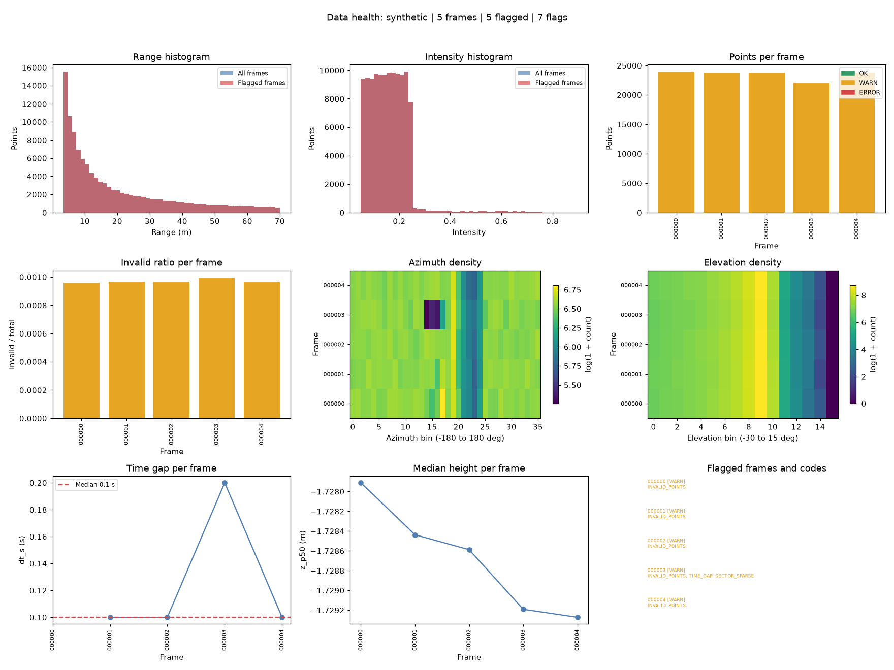
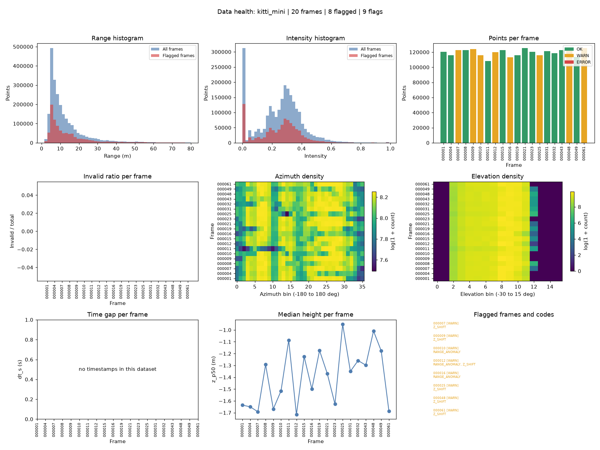
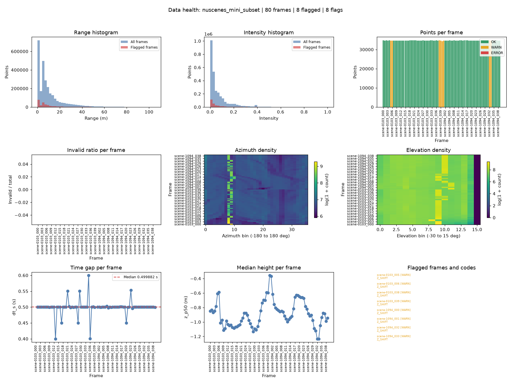
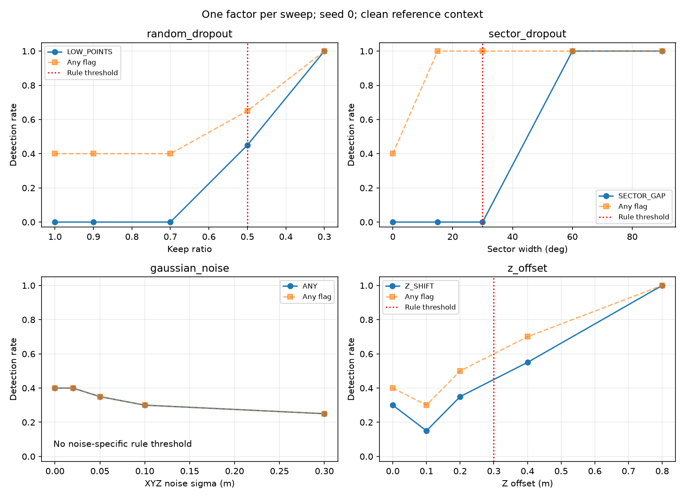
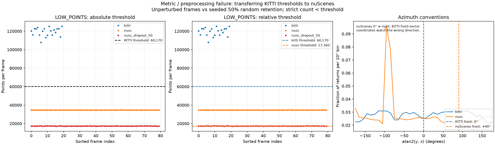

# Báo cáo Day 6: Data health dashboard

- **Họ tên:** Đỗ Đình Long
- **MSSV:** 2A202602673
- **Lớp:** VinUni AI20K – Track 4
- **Link repo:** https://github.com/long2110d/DoDinhLong-2A202602673-Track4-Day21
- **Topic:** E — Data health dashboard
- **Dataset:** data/synthetic, data/kitti_mini, data/nuscenes_mini_subset.
- **Các frame đã dùng:** synthetic 000000–000004; kitti_mini 20 frame; nuScenes toàn bộ scene-0103 và scene-1094.

## 1. Claim

Với baseline cố định từ KITTI sạch và ngưỡng `n_points < 0.5×median`, LOW_POINTS phát hiện toàn bộ 20 frame khi giữ 30% điểm (detection_rate=1.000000).
Trên KITTI không perturb (keep_ratio=1.000000), riêng LOW_POINTS có detection_rate=0.000000; nguồn: [stress_detection.csv](../results/stress_detection.csv).
Đây là kết quả tại mức giữ điểm đã thử, không khẳng định mọi mức thấp hơn đều đã được đo; any_flag_rate trên dữ liệu sạch vẫn là 0.400000 do các rule khác.

## 2. Evidence

Lỗi cấy từ [synthetic_planted_faults.csv](../results/synthetic_planted_faults.csv), ghi đúng rule và giá trị quan sát:
<table><tr><th>fault</th><th>frame_id</th><th>detected_by_rule</th><th>evidence_value</th></tr><tr><td>Non-finite point values</td><td>000000</td><td>INVALID_POINTS</td><td>invalid_ratio=0.00096 &gt; 0</td></tr><tr><td>Non-finite point values</td><td>000001</td><td>INVALID_POINTS</td><td>invalid_ratio=0.000967 &gt; 0</td></tr><tr><td>Non-finite point values</td><td>000002</td><td>INVALID_POINTS</td><td>invalid_ratio=0.000967 &gt; 0</td></tr><tr><td>Non-finite point values</td><td>000003</td><td>INVALID_POINTS</td><td>invalid_ratio=0.000997 &gt; 0</td></tr><tr><td>Possible dropped frame</td><td>000003</td><td>TIME_GAP</td><td>dt_ratio=2 &gt; 1.5</td></tr><tr><td>Partial angular dropout; a sector has less than 35% of mean return density</td><td>000003</td><td>SECTOR_SPARSE</td><td>az_min_bin_ratio=0.311964 &lt; 0.35</td></tr><tr><td>Non-finite point values</td><td>000004</td><td>INVALID_POINTS</td><td>invalid_ratio=0.000968 &gt; 0</td></tr></table>
Median và tỷ lệ trạng thái từ [dataset_comparison.csv](../results/dataset_comparison.csv): KITTI dùng 64 beam, nuScenes dùng 32 beam (cấu hình theo đề bài, lưu ở [submission_dataset_metadata.csv](../results/submission_dataset_metadata.csv)) nên cần baseline riêng; intensity đêm 0.080242 cao hơn ngày 0.058911 trong mẫu này, không chứng minh bóng tối gây thay đổi phản xạ LiDAR.
<table><tr><th>dataset</th><th>n_points</th><th>range_p95</th><th>intensity_mean</th><th>empty_az_bins</th><th>el_span_deg</th><th>dt_s</th><th>ok_pct</th><th>warn_pct</th><th>error_pct</th></tr><tr><td>synthetic</td><td>23781.000000</td><td>58.362843</td><td>0.156056</td><td>0.000000</td><td>41.995437</td><td>0.100000</td><td>0.000000</td><td>100.000000</td><td>0.000000</td></tr><tr><td>kitti</td><td>120340.000000</td><td>32.037134</td><td>0.248707</td><td>0.000000</td><td>28.007615</td><td></td><td>60.000000</td><td>40.000000</td><td>0.000000</td></tr><tr><td>nusc_day</td><td>34720.000000</td><td>31.368383</td><td>0.058911</td><td>0.000000</td><td>61.114492</td><td>0.499876</td><td>90.000000</td><td>10.000000</td><td>0.000000</td></tr><tr><td>nusc_night</td><td>34720.000000</td><td>40.429358</td><td>0.080242</td><td>0.000000</td><td>57.787035</td><td>0.499885</td><td>90.000000</td><td>10.000000</td><td>0.000000</td></tr></table>
Stress KITTI: detection_rate là rule đích (ANY cho nhiễu), any_flag_rate là bất kỳ rule; báo động nền không đồng nghĩa phát hiện nhiễu ([stress_detection.csv](../results/stress_detection.csv)).
<table><tr><th>perturbation</th><th>level</th><th>expected_rule</th><th>detection_rate</th><th>any_flag_rate</th></tr><tr><td>random_dropout</td><td>1.000000</td><td>LOW_POINTS</td><td>0.000000</td><td>0.400000</td></tr><tr><td>random_dropout</td><td>0.900000</td><td>LOW_POINTS</td><td>0.000000</td><td>0.400000</td></tr><tr><td>random_dropout</td><td>0.700000</td><td>LOW_POINTS</td><td>0.000000</td><td>0.400000</td></tr><tr><td>random_dropout</td><td>0.500000</td><td>LOW_POINTS</td><td>0.450000</td><td>0.650000</td></tr><tr><td>random_dropout</td><td>0.300000</td><td>LOW_POINTS</td><td>1.000000</td><td>1.000000</td></tr><tr><td>sector_dropout</td><td>0.000000</td><td>SECTOR_GAP</td><td>0.000000</td><td>0.400000</td></tr><tr><td>sector_dropout</td><td>15.000000</td><td>SECTOR_GAP</td><td>0.000000</td><td>1.000000</td></tr><tr><td>sector_dropout</td><td>30.000000</td><td>SECTOR_GAP</td><td>0.000000</td><td>1.000000</td></tr><tr><td>sector_dropout</td><td>60.000000</td><td>SECTOR_GAP</td><td>1.000000</td><td>1.000000</td></tr><tr><td>sector_dropout</td><td>90.000000</td><td>SECTOR_GAP</td><td>1.000000</td><td>1.000000</td></tr><tr><td>gaussian_noise</td><td>0.000000</td><td>ANY</td><td>0.400000</td><td>0.400000</td></tr><tr><td>gaussian_noise</td><td>0.020000</td><td>ANY</td><td>0.400000</td><td>0.400000</td></tr><tr><td>gaussian_noise</td><td>0.050000</td><td>ANY</td><td>0.350000</td><td>0.350000</td></tr><tr><td>gaussian_noise</td><td>0.100000</td><td>ANY</td><td>0.300000</td><td>0.300000</td></tr><tr><td>gaussian_noise</td><td>0.300000</td><td>ANY</td><td>0.250000</td><td>0.250000</td></tr><tr><td>z_offset</td><td>0.000000</td><td>Z_SHIFT</td><td>0.300000</td><td>0.400000</td></tr><tr><td>z_offset</td><td>0.100000</td><td>Z_SHIFT</td><td>0.150000</td><td>0.300000</td></tr><tr><td>z_offset</td><td>0.200000</td><td>Z_SHIFT</td><td>0.350000</td><td>0.500000</td></tr><tr><td>z_offset</td><td>0.400000</td><td>Z_SHIFT</td><td>0.550000</td><td>0.700000</td></tr><tr><td>z_offset</td><td>0.800000</td><td>Z_SHIFT</td><td>1.000000</td><td>1.000000</td></tr></table>
   
Bảng rule đầy đủ từ [health_rules.csv](../results/health_rules.csv): <table><tr><th>code</th><th>severity</th><th>description</th><th>threshold_text</th></tr><tr><td>INVALID_POINTS</td><td>error if &gt; 1%, otherwise warn</td><td>Non-finite point values</td><td>invalid_ratio &gt; 0; error above 0.01</td></tr><tr><td>LOW_POINTS</td><td>error</td><td>Too few points</td><td>n_points &lt; 0.5*median</td></tr><tr><td>HIGH_POINTS</td><td>warn</td><td>Too many points</td><td>n_points &gt; 1.5*median</td></tr><tr><td>SECTOR_GAP</td><td>error</td><td>Missing angular coverage</td><td>gap &gt;= 30 deg for full-coverage datasets, or empty bins &gt; median+2; relative clause handles limited FOV</td></tr><tr><td>RANGE_ANOMALY</td><td>warn</td><td>Unusual point range</td><td>p95 outside [0.5, 1.5]*median or max &gt; 200 m</td></tr><tr><td>NEAR_BLOCKAGE</td><td>warn</td><td>Excess near-sensor returns</td><td>ratio_within_2m &gt; max(0.05, 3*median)</td></tr><tr><td>INTENSITY_ANOMALY</td><td>warn</td><td>Unusual reflectance</td><td>zero &gt; 0.9, saturation &gt; 0.2, or mean deviation &gt; 3*1.4826*max(MAD, 0.01)</td></tr><tr><td>Z_SHIFT</td><td>warn</td><td>Ground or mounting height drift</td><td>abs(z_p50-median) &gt; 0.3 m</td></tr><tr><td>DUPLICATE_FRAME</td><td>error</td><td>Repeated point cloud</td><td>hash equals an earlier frame</td></tr><tr><td>TIME_GAP</td><td>warn</td><td>Possible dropped frame</td><td>dt_ratio &gt; 1.5</td></tr><tr><td>TIME_NONMONOTONIC</td><td>error</td><td>Non-increasing timestamp</td><td>dt_s &lt;= 0</td></tr><tr><td>SECTOR_SPARSE</td><td>warn</td><td>Partial angular dropout; a sector has less than 35% of mean return density</td><td>az_min_bin_ratio &lt; 0.35 for full-coverage datasets</td></tr></table>

## 3. Failure case


Lớp debug **Metric**: chuyển ngưỡng tuyệt đối từ KITTI sang nuScenes khiến cả 80 frame không perturb bị gắn LOW_POINTS (flagged_ratio=1.000000); baseline riêng giảm xuống 0.000000 ([failure_case.csv](../results/failure_case.csv)).
Mật độ cảm biến khác nhau là nguyên nhân; ngưỡng tương đối chỉ phát hiện 39/80 frame nuScenes giữ một nửa điểm (0.487500), nên không bảo đảm phát hiện tại sát biên ngưỡng.
Lớp **Geometry**: với atan2(y,x), phía trước KITTI theo trục x, phía trước nuScenes theo trục y; dùng cùng sector sẽ giám sát sai hướng vì x của nuScenes chỉ sang phải.
Trong production, lưu baseline riêng theo cảm biến và cấu hình, kiểm tra hướng trục trước khi gán sector, theo dõi dịch chuyển phân bố trên dữ liệu sạch đã xác nhận.

## 4. Khuyến nghị nếu triển khai thật

ADAS hoặc robot có thể dùng dashboard để cảnh báo mất điểm, vùng mù và gián đoạn sweep trước khi đưa dữ liệu vào nhận thức môi trường.
Ngưỡng tương đối cần warm-up trên dữ liệu khỏe; đóng băng baseline khi cảnh báo để tránh học theo lỗi kéo dài, cân bằng độ nhạy và báo động nền.
Latency CPU p50/p95: KITTI 135.948400/152.284815 ms; nuScenes 37.961900/42.175010 ms ([stress_latency.csv](../results/stress_latency.csv)); đây là đo stats và rule trên máy hiện tại, cần đo lại ngân sách thời gian của hệ thống thật.
Log online: points/frame, sector gap, invalid ratio, dt giữa sweeps, z_p50; bổ sung mã cảm biến và trạng thái baseline để truy nguyên cảnh báo.

## 5. Cách chạy lại

Chạy từ gốc repo; Windows kích hoạt venv bằng lệnh dưới, các lệnh cùng dòng thực hiện từ trái sang phải.
```powershell
python -m venv .venv; .\.venv\Scripts\Activate.ps1; pip install -r requirements.txt
python -m src.health_dashboard --data-root data/synthetic --out-dir results; python -m src.health_dashboard --data-root data/kitti_mini --out-dir results; python -m src.health_dashboard --data-root data/nuscenes_mini_subset --out-dir results; python -m src.compare_datasets --out-dir results
python -m src.stress_test --data-root data/kitti_mini --out-dir results; python -m src.failure_case --data-root data --out-dir results
python -m pytest -q src/tests; python tools/check_submission.py
```
CSV deterministic cần giống byte khi chạy lại; riêng latency đo thời gian thực nên thay đổi giữa các lần đo.

## 6. Khai báo sử dụng AI

| Công cụ | Dùng cho việc gì | Kiểm chứng |
|---|---|---|
| Claude Opus | Lập kế hoạch trong PLAN.md | Đối chiếu yêu cầu và phạm vi từng task |
| Codex | Viết code theo từng task, hoàn thiện báo cáo | Unit test với mảng tự tạo, đối chiếu số liệu CSV |
| Claude Sonnet | Review từng diff và kết quả test theo quy trình đã duyệt | Đối chiếu logic và bằng chứng kiểm thử; phiên Task này không tự xác nhận review ngoài phiên |
Kiểm tra CP2 bằng điểm (10,0,0): z≈9.73, (u,v)≈(614,175); tính trực tiếp z=9.727321, (u,v)=(613.964149,175.006537) tại [submission_verification.csv](../results/submission_verification.csv).
Quy trình xác minh: chạy lại script và so CSV deterministic theo byte, kiểm tra trực quan từng figure, đối chiếu số đo báo cáo với CSV; latency đối chiếu bản đo lưu, không yêu cầu giống byte.
